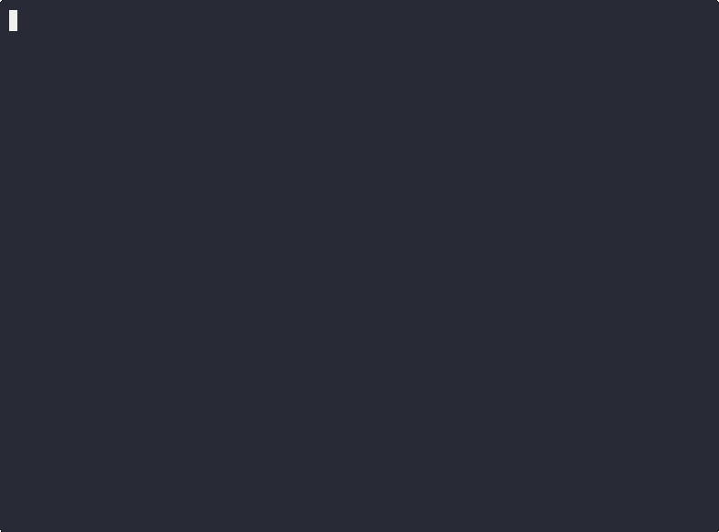

# rulepack

`rulepack` is a CLI for sharing, pinning, and building AI agent rules across projects with reproducible outputs.

[](https://github.com/alexgornovoi/rule-pack/releases)
[](https://github.com/alexgornovoi/rule-pack/blob/main/go.mod)

[Releases](https://github.com/alexgornovoi/rule-pack/releases) · [Issues](https://github.com/alexgornovoi/rule-pack/issues) · [Examples](./examples/README.md) · [Spec](./docs/rulepack-spec.md)

## On This Page

- [Quickstart](#quickstart-60-seconds)
- [Quick Reference](#quick-reference)
- [Install](#install)
- [Core Workflow Recipes](#core-workflow-recipes)
- [Commands Reference](#commands-reference)
- [Generated Outputs](#generated-outputs)
- [Advanced Workflows](#advanced-workflows)
- [Troubleshooting FAQ](#troubleshooting-faq)
- [Prompt Repository Maintainer Guide](#prompt-repository-maintainer-guide)

## Quickstart (60 seconds)

Start a new project, add one rules source, resolve dependencies, then build outputs.

```bash
rulepack init --name my-project
rulepack deps add https://github.com/your-org/your-rules.git
rulepack deps install
rulepack build
```

> [!TIP]
> Replace `https://github.com/your-org/your-rules.git` with your own rules repository URL.



_Quickstart flow preview: init -> deps add -> deps install -> build._

## Quick Reference

| Task | Command |
| --- | --- |
| Initialize project | `rulepack init --name my-project` |
| Add dependency | `rulepack deps add <git-url>` |
| Resolve lockfile | `rulepack deps install` |
| Build outputs | `rulepack build` |
| Run diagnostics | `rulepack doctor` |

## Why Rulepack

- Reuse one shared rules library across many projects.
- Keep outputs deterministic with lockfiles.
- Build rules for Cursor, Copilot, and Codex from the same source.
- Save the current dependency stack as a reusable local profile snapshot.

Typical use cases:

- Team-level rule pack in git consumed across repos.
- Personal local rule folders while iterating on prompts/rules.
- Snapshotting a known-good setup before starting a new project.

## Install

### Homebrew (macOS/Linux)

Install via tap:

```bash
brew tap alexgornovoi/homebrew-tap
brew install --cask rulepack
```

Install directly without tapping first:

```bash
brew install --cask alexgornovoi/homebrew-tap/rulepack
```

### Ubuntu PPA

```bash
sudo add-apt-repository ppa:alexgornovoi/rulepack
sudo apt update
sudo apt install rulepack
```

## Core Workflow Recipes

> [!NOTE]
> When `--export` is omitted, Rulepack uses `exports.default` if present; otherwise it includes all modules (`include: ["**"]`).

### From zero (local prompt repository)

Use this when you want a complete local setup without publishing a git repo first.

```bash
rulepack init --name my-local-project
rulepack deps add --local ./prompt-library --export default
rulepack deps install
rulepack build
rulepack doctor
```

### Example: Python-only rules

Use one exported ruleset for a Python project.

```bash
rulepack init --name my-python-project
rulepack deps add https://github.com/your-org/your-rules.git --export python
rulepack deps install
rulepack build
```

### Example: Python + ML rules from one repo

Install two exports from the same dependency source.

```bash
rulepack init --name my-ml-project
rulepack deps add https://github.com/your-org/your-rules.git --export python
rulepack deps add https://github.com/your-org/your-rules.git --export ml
rulepack deps install
rulepack build
```

### Pin a known reference

Pin to a commit, tag, or branch.

```bash
rulepack deps add https://github.com/your-org/your-rules.git --ref v1.2.3
rulepack deps install
rulepack build
```

### Use local rules while authoring

Prefer local path mode for rapid local iteration.

```bash
rulepack deps add --local ../my-rules --export python
rulepack deps install
rulepack build --target codex
```

## Commands Reference

Global flags:

| Flag | Purpose | Default |
| --- | --- | --- |
| `--json` | Emit machine-readable output | `false` |
| `--no-color` | Disable ANSI colors in human output | `false` |

### Project setup commands

| Command | Purpose | Common flags | Notes |
| --- | --- | --- | --- |
| `rulepack init` | Create starter `rulepack.json` | `--name`, `--template rulepack` | `--name` defaults to current directory name |
| `rulepack doctor` | Run diagnostics on config/lockfile/git/profile store | none | Use after setup or when troubleshooting |

### Dependency commands

| Command | Purpose | Common flags | Notes |
| --- | --- | --- | --- |
| `rulepack deps add [git-url]` | Add or replace dependency | `--export`, `--version`, `--ref`, `--local`, `--yes` | `--version` and `--ref` are mutually exclusive; git-only |
| `rulepack deps list` | List dependencies and lock status | none | Quick check before install/build |
| `rulepack deps remove <selector>...` | Remove one or more dependencies | `--yes` | Alias: `rulepack deps uninstall` |
| `rulepack deps install` | Resolve dependencies and write lockfile | none | Writes `rulepack.lock.json` |
| `rulepack deps outdated` | Check for newer resolvable git revisions | none | Use before refresh/reinstall |

### Build commands

| Command | Purpose | Common flags | Notes |
| --- | --- | --- | --- |
| `rulepack build` | Build target outputs from lockfile | `--target cursor\|copilot\|codex\|all`, `--yes` | `--target` defaults to `all` |

> [!WARNING]
> In non-interactive or `--json` mode, operations that require confirmation (for example `deps add` replacement, some `build` collisions, profile updates) require `--yes`.

### Profile commands

| Command | Purpose | Common flags | Notes |
| --- | --- | --- | --- |
| `rulepack profile save` | Save dependencies as a local profile snapshot | `--alias`, `--dep`, `--switch` | `--alias` required in non-interactive mode |
| `rulepack profile list` | List saved profiles | none | Reads global profile store |
| `rulepack profile show <id-or-alias>` | Show profile metadata/details | none | Use to inspect one profile |
| `rulepack profile use <id-or-alias>` | Add/update dependency using a saved profile | none | Can be combined with non-profile dependencies |
| `rulepack profile remove <id-or-alias>` | Remove one profile | `--yes`, `--all` | Alias: `rulepack profile delete` |
| `rulepack profile diff <id-or-alias>` | Compare snapshot modules with source state | `--rule` repeatable | Use before refresh |
| `rulepack profile refresh <id-or-alias>` | Update snapshot from source state | `--new-id`, `--rule`, `--dry-run`, `--yes` | In-place updates can require `--yes` |

<details>
<summary>Edge-case behavior and resolution rules</summary>

- `--version` and `--ref` cannot be used together.
- `--version`/`--ref` cannot be combined with `--local`.
- If neither `--version` nor `--ref` is set, git dependencies resolve from `HEAD` during `deps install`.
- If `rulepack.json` is missing, `deps add` auto-initializes a default config.
- Selector support for `deps remove`: 1-based index, exact `uri`, exact local `path`, or `profile id`.

</details>

## Generated Outputs

| Target | Default output path |
| --- | --- |
| `cursor` | `.cursor/rules/` |
| `copilot` | `.github/copilot-instructions.md` |
| `codex` | `.codex/rules.md` |

## Advanced Workflows

<details>
<summary>Reuse one saved profile across multiple projects</summary>

When to use this: you want one known-good baseline reused in many repositories.

```bash
rulepack profile save --alias python-a
rulepack init --name project-b
rulepack profile use python-a
rulepack deps install
rulepack build
```

</details>

<details>
<summary>Use local rules while authoring with template scaffold</summary>

When to use this: you are actively editing rules and want local changes reflected quickly.

```bash
rulepack init --name my-project --template rulepack
rulepack deps install
rulepack build
```

</details>

<details>
<summary>Refresh a profile from source changes</summary>

When to use this: you need to pull upstream rule updates into an existing profile snapshot.

```bash
rulepack profile refresh python-a
rulepack profile refresh python-a --new-id
rulepack profile refresh python-a --rule python.* --rule ml.safety
```

</details>

<details>
<summary>Check for upstream updates before reinstalling</summary>

When to use this: you want to preview dependency freshness before changing your lockfile.

```bash
rulepack deps outdated
```

</details>

<details>
<summary>Preview profile source drift before refresh</summary>

When to use this: you need a scoped diff before deciding whether to refresh.

```bash
rulepack profile diff python-a
rulepack profile diff python-a --rule python.* --rule ml.*
```

</details>

## Compatibility

| Area | Support |
| --- | --- |
| Install channels | Homebrew cask, Ubuntu PPA, source build |
| Output targets | `cursor\|copilot\|codex\|all` |
| Source types | `git`, `local`, `profile` |
| Lockfile | `rulepack.lock.json` for deterministic resolution |
| Human/machine output | human (default), `--json` |

## Troubleshooting FAQ

### `rulepack` command not found after install

- Confirm your package manager install completed successfully.
- Run `rulepack --help` in a new terminal session.
- If still missing, reinstall from your chosen channel and verify PATH setup.

### `deps install` fails on git dependency resolution

- Run `rulepack doctor` to validate git client and environment.
- Verify repository URL, access permissions, and any pinned `--ref`/`--version` constraints.
- Retry with a reachable ref or remove incompatible constraints.

### Lockfile and build outputs appear out of sync

- Re-run `rulepack deps install` before `rulepack build`.
- Confirm dependency list with `rulepack deps list`.
- If switching profile/local sources, reinstall to refresh lock state.

### Non-interactive runs fail with confirmation prompts

- Add `--yes` for operations that can require confirmation in non-interactive or `--json` mode.
- Use this carefully in CI where no prompt interaction is available.

### Common mistakes

- Running `rulepack build` before `rulepack deps install`.
- Using an `--export` name that does not exist in the dependency's `rulepack.json`.
- Editing a local dependency and forgetting to re-run `rulepack deps install`.

## Build From Source (Go)

Clone and build:

```bash
git clone https://github.com/alexgornovoi/rule-pack.git
cd rule-pack
go build -o bin/rulepack ./cmd/rulepack
./bin/rulepack --help
```

Run without building (development only):

```bash
go run ./cmd/rulepack --help
```

## Output Behavior

- Module content is normalized to LF newlines.
- Merge order is deterministic: priority ascending, then module ID.
- Duplicate module IDs after composition are rejected.
- Cursor per-module output includes provenance headers plus one file per module.
- Copilot and Codex outputs are merged files without provenance headers.

## Dependency Resolution Details

- Supported source types: `git`, `local`, `profile`.
- If `--ref` is set, Rulepack resolves `ref^{commit}`.
- If `--version` is set, tags are parsed as semver (leading `v` allowed) and the highest matching version is selected.
- If neither `--version` nor `--ref` is set, Rulepack resolves `HEAD`.
- For `local` sources, lockfile entries pin local `path` and `contentHash`.
- For `profile` sources, lockfile entries pin profile `contentHash`.
- Git repositories are cached under your user cache directory in a `rulepack` folder.

## Prompt Repository Maintainer Guide

Use this guide to create a prompt/rules repository that can be consumed by Rulepack via `git` or `--local`.

### 1) Create the repository structure

Minimum layout:

```text
my-prompt-repo/
  rulepack.json
  modules/
    foundation/
      overview.md
```

Rules:

- `rulepack.json` must be at repository root.
- Every module `path` must point to a file that exists in the repo.
- Keep module files as Markdown text (`.md` works well with all targets).

### 2) Define a valid root `rulepack.json`

Required top-level fields are `specVersion`, `name`, and `version` (non-empty strings).
Concrete example from this repo: [prompt-library/rulepack.json](./prompt-library/rulepack.json).

Starter template:

```json
{
  "specVersion": "0.1",
  "name": "my-prompt-repo",
  "version": "0.1.0",
  "modules": [
    {
      "id": "foundation.overview",
      "path": "modules/foundation/overview.md",
      "priority": 100
    }
  ],
  "exports": {
    "default": {
      "include": ["**"]
    }
  }
}
```

### 3) Follow module authoring rules

- `modules[].id` should be unique and stable (recommended dotted namespace, for example `languages.python.patterns`).
- `modules[].priority` controls merge order (`lower` first, then `id` as tiebreaker).
- Duplicate module IDs across composed dependencies are rejected at build time.

Optional `apply` metadata can control per-target behavior:

- `always` (default when unspecified)
- `never`
- `agent` (with `description`)
- `glob` (requires non-empty `globs`)
- `manual`

### 4) Define exports for consumer-friendly subsets

Exports let consumers install only part of your repository.

- `exports.default` is used when consumers do not pass `--export`.
- If `exports.default` is absent, Rulepack implicitly selects all modules (`include: ["**"]`).

Example:

```json
{
  "exports": {
    "default": { "include": ["**"] },
    "core": { "include": ["foundation.*", "standards.*", "languages.*"] },
    "docs": { "include": ["tasks.documentation"] }
  }
}
```

### 5) Validate your repo as a consumer would

From a separate test project:

```bash
rulepack init --name repo-validation
rulepack deps add https://github.com/your-org/your-prompt-repo.git --export default
rulepack deps install
rulepack build
rulepack doctor
```

For local iteration:

```bash
rulepack deps add --local ../my-prompt-repo --export default
rulepack deps install
rulepack build
```

## File Reference

- Spec: [docs/rulepack-spec.md](./docs/rulepack-spec.md)
- Example setup: [examples/README.md](./examples/README.md)


## Contributors

Contributions are welcome.

- Open an issue first for bugs, UX pain points, or feature proposals.
- Send a PR with a clear description of the user impact.
- Include or update tests for CLI behavior changes (`human` and `--json` modes).

## License

This project is licensed under the MIT License. See [LICENSE](./LICENSE) for details.
